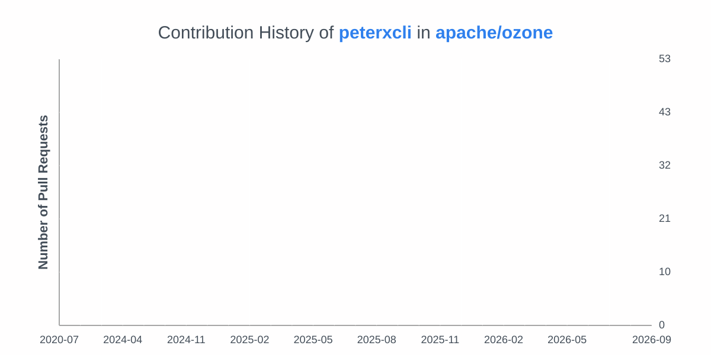
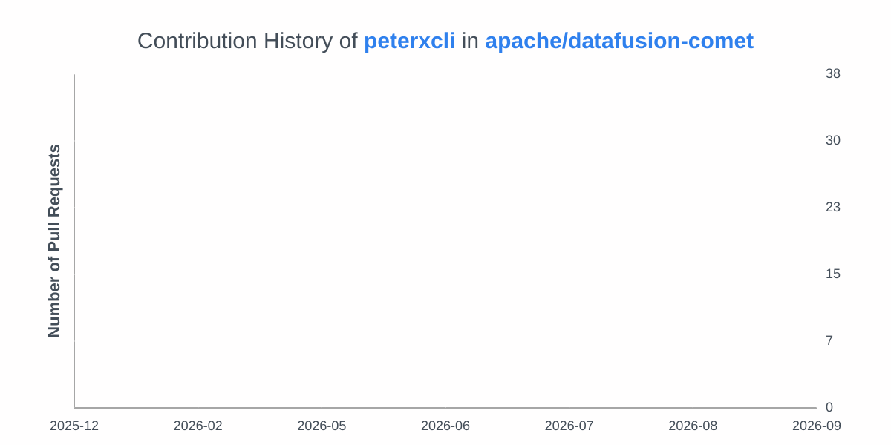
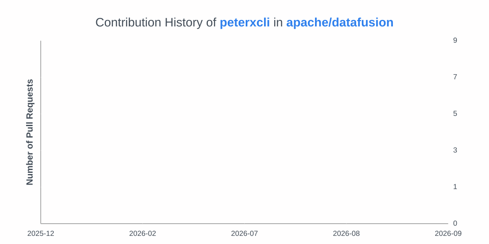
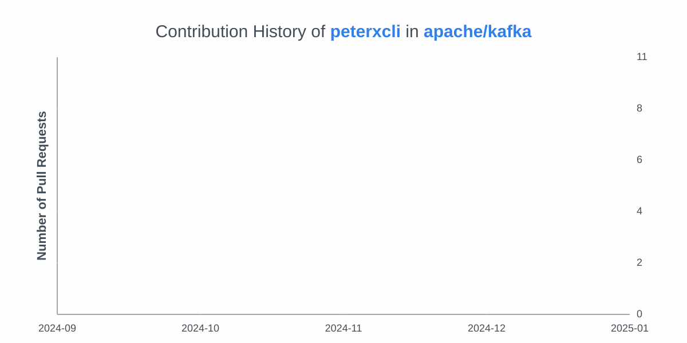
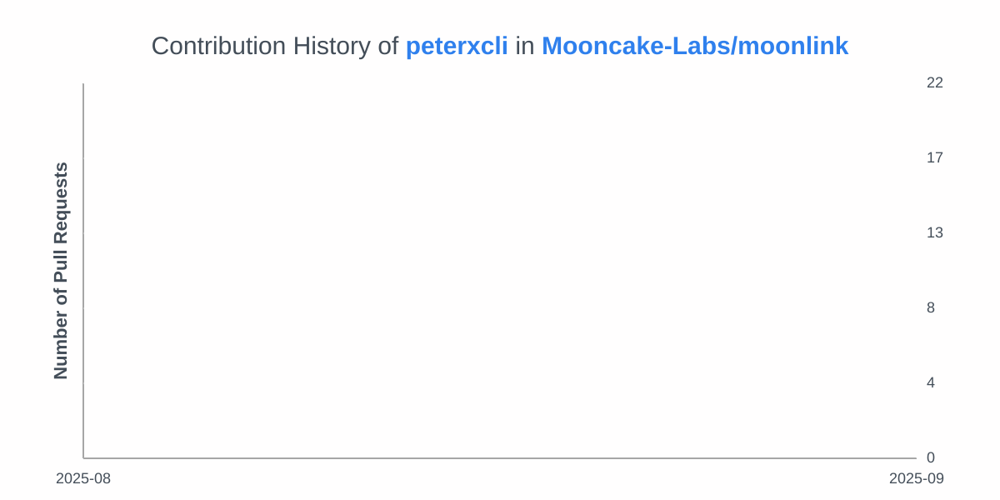
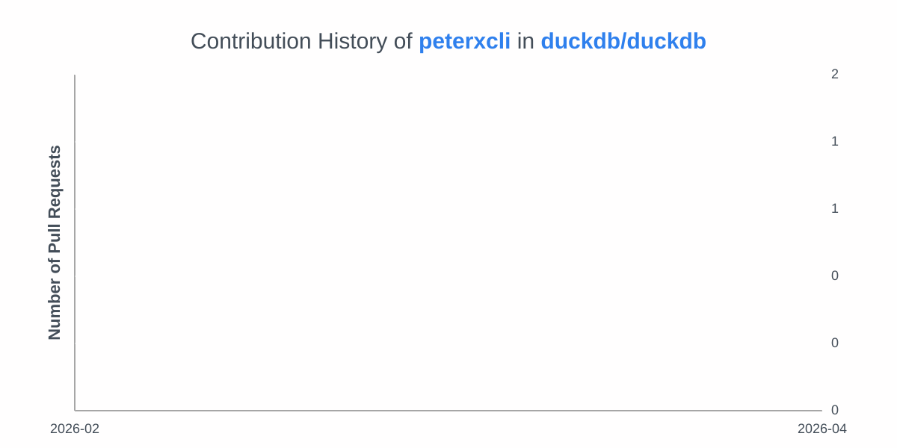
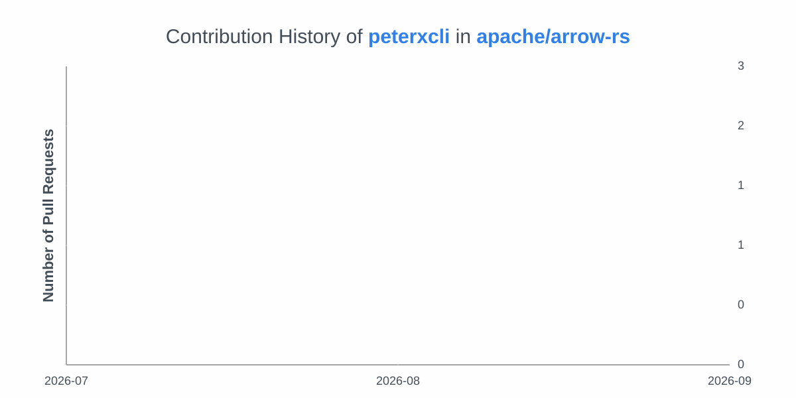
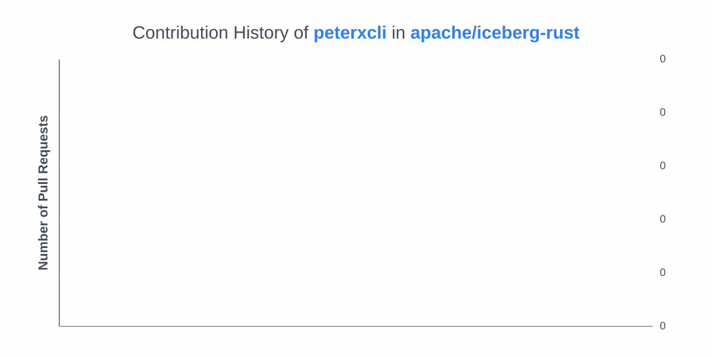

# Peter Lee (李緒成)

I am PMC member of Apache Ozone, focused on distributed systems and database internals. My work involves optimizing storage/query engines, improving system throughput, and contributing to core infrastructure in the open-source ecosystem.

---

### Open Source Contribution

| [Apache Ozone (PMC Member)](https://github.com/apache/ozone/pulls?q=is:pr+author:peterxcli) | [DataFusion Comet](https://github.com/apache/datafusion-comet/pulls?q=is:pr+author:peterxcli+is:merged) |
| --- | --- |
|  |  |
| [DataFusion](https://github.com/apache/datafusion/pulls?q=is:pr+author:peterxcli+is:merged) | [Apache Kafka](https://github.com/apache/kafka/pulls?q=is:pr+author:peterxcli+is:merged) |
|  |  |
| [Moonlink](https://github.com/Mooncake-Labs/moonlink/pulls?q=is:pr+author:peterxcli+is:merged) | [DuckDB](https://github.com/duckdb/duckdb/pulls?q=is:pr+author:peterxcli+is:merged) |
|  |  |
| [Arrow-rs](https://github.com/apache/arrow-rs/pulls?q=is:pr+author:peterxcli+is:merged) | [Iceberg-rust](https://github.com/apache/iceberg-rust/pulls?q=is:pr+author:peterxcli+is:merged) |
|  |  |

---

### My Projects

- [duckdb-query-condition-cache](https://github.com/dentiny/duckdb-query-condition-cache): Adds predicate cache to DuckDB. It caches which row groups match a filter, so repeated queries can skip work and run much faster. It fits workloads like metrics monitoring dashboards, log investigation, and other recurring read paths where the same filters come up again and again.
- [duckdb-cache-prewarm](https://github.com/dentiny/duckdb-cache-prewarm): A DuckDB extension that preloads table data blocks into the buffer pool or OS page cache, inspired by PostgreSQL's pg_prewarm extension.
- [ad-server](https://github.com/peterxcli/ad-server): A infinite scalable advertisement management system, baked with replicated advertisement business state machine, replicated log system, and fault recovery mechanism. Guaranteed the consistency and durability of the advertisement operation.
- [bike-festival-2024-backend](https://github.com/peterxcli/bike-festival-2024-backend): Backbone for the 2024 NCKU Bike Festival, featuring event notifications and Line Login for authentication. Built with Go, Docker, and Redis.
- [basic-auth-gin](https://github.com/peterxcli/basic-auth-gin): a RESTful API framework built atop the Gin and MongoDB, JWT authentication middleware, Google OAuth API, SendGrid email API, and SSL support

