    

<!--         <h2>About Me</h2> -->
        

            I'm Peter, currently diving into the depths of Computer Science and
            Engineering at NCKU CSIE. With a passion for exploring new
            technologies and building solutions. Focusing on distributed systems.
            Currently working on some OSS projects, including <a href="https://github.com/apache/ozone">Ozone</a> and <a href="https://github.com/apache/kafka">Kafka</a>.
        

<!--         <h2>📫 How to Reach Me</h2> -->
        
        
        
    

<!--     <h2 align="center">Skills 🛠️</h2>
    

        <h3>Languages 💻</h3>
        
        
        
        
        
        
    

    

        <h3>Frameworks 🛠️</h3>
        
        
        
        
        
    

    

        <h3>Databases 📂</h3>
        
        
        
        
    

    

        <h3>Message Brokers 💬</h3>
        
        
    

    

        <h3>DevOps ⚙️</h3>
        
        
        
        
        
        
        
    

    

        <h3>Cloud ☁️</h3>
        
        
        
        
    
 -->
    <h2 align="center">Open Source Contribution</h2>
    
    <h2 align="center">Metrics</h2>
    

        <table>
            <tr>
                <td align="center">
                    
                </td>
                <td align="center">
                    
                </td>
            </tr>
            <tr>
                <td align="center">
                    
                </td>
                <td align="center">
                    
                </td>
            </tr>
        </table>
    

